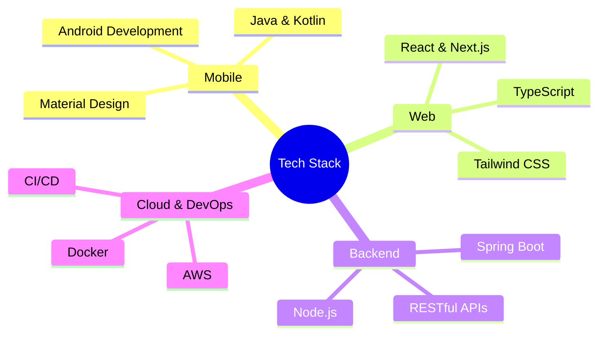

<div align="center">


[](https://shashi.app)
[](https://github.com/ShashiLab)
[](https://www.linkedin.com/in/codershashi/)

*Building privacy-focused solutions that make a difference* 🚀

</div>

## 👨‍💻 About Me

Hey there! I'm a passionate self-taught developer who believes in the power of code to make the world a better place. When I'm not crafting Android apps or building web solutions, you'll find me contributing to open-source projects and sharing knowledge with the developer community.

```typescript
const shashi = {
    code: ["Java", "Kotlin", "JavaScript", "TypeScript"],
    askMeAbout: ["app dev", "web dev", "privacy", "open source"],
    technologies: {
        mobile: ["Android SDK", "Jetpack Compose"],
        frontend: ["React", "Next.js", "Tailwind"],
        backend: ["Node.js", "Express", "Spring Boot"],
        database: ["MongoDB", "Firebase", "SQLite"],
        tools: ["Git", "Docker", "AWS"]
    },
    currentFocus: "Building privacy-first applications",
    funFact: "I write more readable comments than witty Instagram captions"
};
```

## 🎯 Featured Project: VigiLens

Ever wished for a security camera that respects your privacy? That's what VigiLens is all about! It's not just another surveillance app – it's your privacy-focused security companion.

<div align="center">

[](https://github.com/ShashiLab/VigiLens)

</div>

### ✨ Key Features
- 🔐 End-to-end encryption keeps your footage private
- 📱 Smart background recording with minimal battery impact
- 🛡️ Advanced privacy controls put you in charge
- 💾 Local-first storage - your data never leaves your device
- 🌐 Optional secure cloud backup

## 🚀 My Journey in Numbers

<div align="center">

| 🏆 5+ Open Source Projects | ⭐ 1000+ GitHub Stars | 🤝 500+ Pull Requests | ☕️ 1000+ Coffee Cups |
|:------------------------:|:--------------------:|:--------------------:|:-------------------:|

</div>

## 📊 GitHub Analytics

<div align="center">

[](https://github.com/ShashiLab)

[](https://github.com/ShashiLab)

</div>

## 🛠️ Tech Stack



## 🌱 Current Focus

- Building **VigiLens 2.0** with enhanced privacy features
- Learning cloud architecture and distributed systems
- Contributing to privacy-focused open source projects
- Writing technical articles on my [blog](https://shashi.app/blog)

## 🤝 Let's Connect!

I'm always excited to connect with fellow developers and tech enthusiasts. Whether you want to discuss code, collaborate on a project, or just chat about the latest in tech, feel free to reach out!

<div align="center">

[](mailto:ShashiTheDev@gmail.com)
[](https://twitter.com/codershashi)
[](https://instagram.com/codershashi)

</div>

### 💭 Random Dev Quote
> "The best error message is the one that never shows up." - Thomas Fuchs

<div align="center">

---
<sub>Made with 💻 and ❤️ by Shashi | Last updated: January 2025</sub>


</div>
